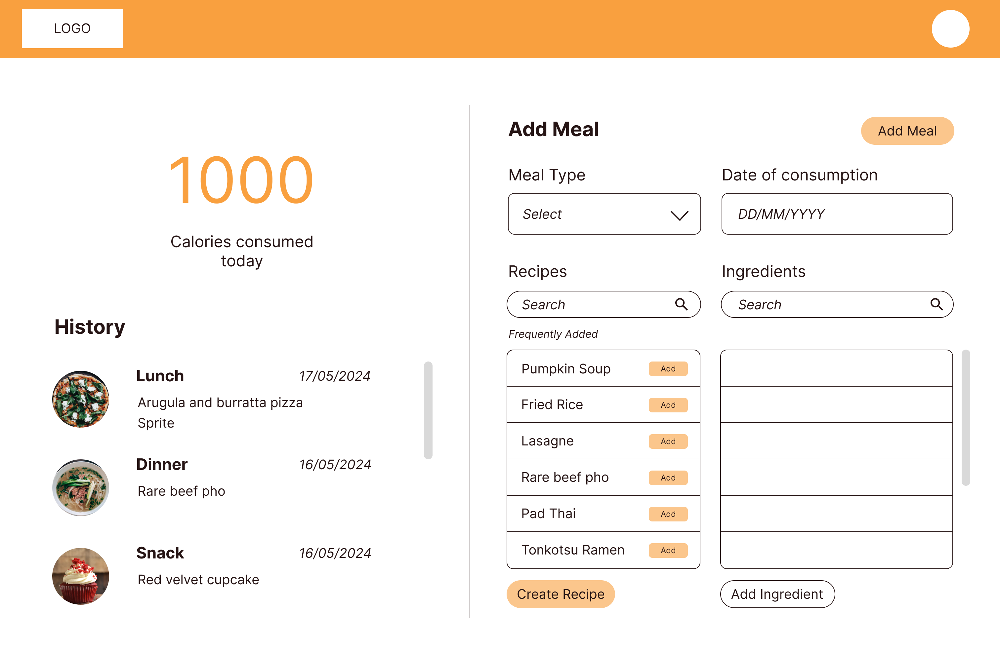

# stef9857-tracker.git.io
 
## Overview
Calolog is a simple single-page application (SPA) that allows users to track their calorie (measured in kcal) intake through logging their meals. It is built using HTML, CSS and Javascript, and used 'localStorage' for data persistance.

## Version Control
This project uses Git and Github for tracking changes and managing development. Please see the Github repository here: https://github.com/Stef9857/stef9857-tracker.git.io

## Features
- **Daily Calorie Intake Number**: This application displays the total amount of kilocalories the user has logged consuming today.
- **Create Ingredient**: When the user first opens this application, they will see a form that allows them to create an ingredient, using the fields 'Ingredient Name', 'Kcal Count' and 'Ingredient Category'. 
- **Ingredients List**: This shows the user the list of their created ingredients with information like kcal count and ingredient category.
- **Clear All Lists**: This button, found in the Create Ingredient feature, clears all items from localStorage.
- **Create Recipe**: The user can also create recipes, which have a name and contain a group of one or more ingredients created in the previous feature.
- **Recipes List**: This shows the user the list of their created recipes and their resepctive kcal count.
- **Create Meal**: The user can use these recipes to create a meal (such as breakfast or lunch), which contains a name, date, time and group of one or more recipes the user consumed during the meal. 
- **Recent Meals**: This feature allows users to access the history of their meals, with information like the date, time and recipes of each meal. A line has been used to separate today's meals from the rest of the meal history.

## Installation and Setup
1. Install node.js
2. Install parcel
3. Install Git or GitHub
4. Clone this repository: git clone https://github.com/Stef9857/stef9857-tracker.git.io
5. To run, use the command: npm run dev
6. Open the page using the url http://localhost:1234

## Usage
1. To run, use the command: npm run dev
2. Open the page using the url http://localhost:1234

Once the page is open, start creating ingredients, then recipes and finally meals, and track your calorie count every day!

## Design Choices
- **Meals, Recipes and Ingredients forms**: In the wireframes, I originally used pop-ups to enable users to access the Create Ingredient and Create recipe features. However, upon reflection, these are features that users may want to use quite a bit, so I changed their presentation to be in the form of tabs with descriptive headings to simultaneously show users all the features available, and to give each feature it's own section to more cleanly separate their functionalities. This is because pop-ups can be finicky for users, and are not usually associated with main features of an application.
- **Images**: In the wireframes, I intended for each meal in the Recent Meals feature to have an image attached to alleviate some of the text-heaviness of the original UI. However, due to the use of localStorage over a database (due to cost constraints), it would have made the user experience more tedious to have to search for an image for every recipe the user wants to create. Instead, I have removed this feature, and increased the whitespace of the application to help reduce some of the text-heavy elements. The change to tabs for the meals, recipes and ingredients forms discussed above also helped with this. 
- **Colour Palette**: As shown below in the high-fidelity mockup of my wireframe homepage, I settled on using orange as the call-to-action colour of my webpage, as orange has connotations of freshness and excitement, while also lending itself to food thanks to apps like MenuLog. I also decided to keep my secondary colour as a lighter orange to enhance the minimal and clean aesthetic of the overall design. 

- **Daily Calorie Count**: I decided to move the text 'Kilocalories consumed today' to above the actual number to improve the overall hierarchy of the design. I also decided to make the number black instead of the call-to-action colour (orange) as it does not require user interaction.
- **Mobile vs Desktop**: On the mobile version, all the elements are stacked vertically, as is recommended for narrower screens. However, on desktop devices, I decided to move elements like the Ingredients and Recipe lists to be next to their respective forms, as well as moving some form fields with shorter inputs to be inline with other relatively narrow elements to increase the whitespace available while being mindful of not clustering too many elements together. 
- **Using Placeholder Text**: After getting user feedback on my earlier prototypes, I added more descriptive placeholder text to ensure users understand the correct input for each form field. This was especially important for the meal form's 'Meal Name' field, as users were confused at first about what to write here. By giving examples like 'Breakfast, Lunch, Dinner', I was able to create a smoother user experience. 

## Limitations
- **Local Storage**: This application uses localStorage for data persistance, meaning the data input by the user is limited to their current browser and device. If the user opens the application on a different browser or a different device, they will not be able to see the ingredients, recipes and meals created on the original browser and device.
- **Manual Data Input**: Currently, this web application requires users to manually create ingredients and recipes, as it does not use a database due to cost limitations. In future versions, it is recommended to use a database for a smoother user experience. 
- **Deleting Individual Items**: During the wireframe and planning stage, I was unaware of the difficulties of deleting individual ingredients. However, as I went to code this feature in, I realised that deleting an ingredient would mean recipes could now be 'incomplete', and subsequently, meals would have incomplete recipes. As such, the current delete function can only clear the entire list of meals, meals and recipes, or meals, recipes and ingredients. In future versions, it would be ideal to show pop-up as a warning to users before they delete an individual item that enables them to edit existing affected items (i.e. meals and recipes) so that they are aware and in control of all affected items. 

## Acknowledgements

### Sources
- Darth Egregious. (2015, April 21). *Format JavaScript date as yyyy-mm-dd*. Stack Overflow. https://stackoverflow.com/a/29774197
- Layoutit!. (n.d.). Layoutit!. https://grid.layoutit.com/ 
- Mdn Web Docs. (n.d.). *Array.prototype.sort()*. https://developer.mozilla.org/en-US/docs/Web/JavaScript/Reference/Global_Objects/Array/sort
- Srinivasan, S. (2020, July 1). *pizza with green leaves on top* [Photograph]. Unsplash. https://unsplash.com/photos/pizza-with-green-leaves-on-top-60nzTP7_hMQ
- Winkler, M. (2020, February 28). *white noodle soup with green leaf vegetable in white ceramic bowl* [Photograph]. Unsplash. https://unsplash.com/photos/white-noodle-soup-with-green-leaf-vegetable-in-white-ceramic-bowl-08aic3qPcag 
- W3Schools. (n.d.a.). *How TO - Custom Scrollbar*. https://www.w3schools.com/howto/howto_css_custom_scrollbar.asp
- W3Schools. (n.d.b.). *How TO - Tabs*. https://www.w3schools.com/howto/howto_js_tabs.asp 
- W3Schools. (n.d.c.). *JavaScript parseFloat()*. https://www.w3schools.com/jsref/jsref_parsefloat.asp   
- Zerpa, L. (2021, March 3). *white and red cupcake with white icing on top* [Photograph]. Unsplash. https://unsplash.com/photos/white-and-red-cupcake-with-white-icing-on-top-MJPr6nOdppw 

### AI Uses Acknowledgements 
The following parts of this project were initally generated with ChatGPT4 with the following prompts:
- **Ingredient Category**: "how can I create a 'category' object property that updates with user input?"
- **Calorie Calculator**: "how can I calculate the kcal total from the list of ingredients" and "can i add the calorie total to the meal using the calorie total from the recipes or ingredients?"